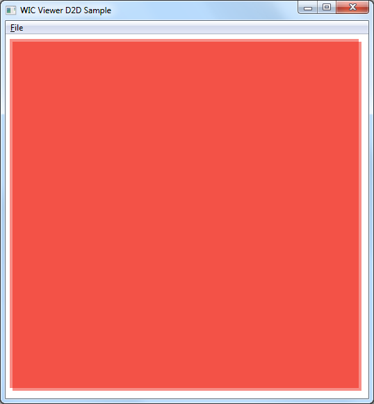
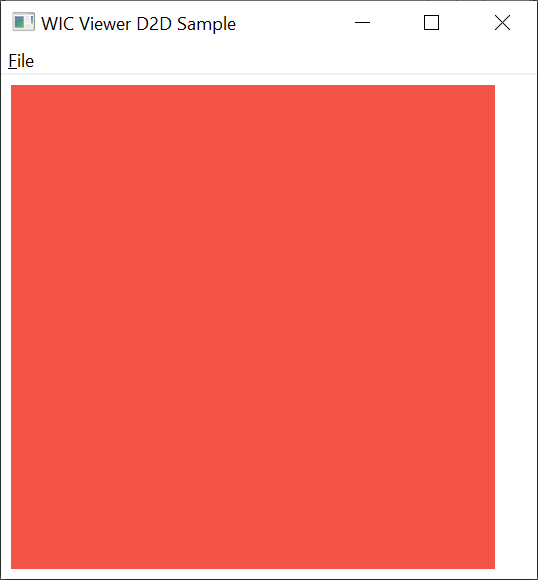

# Direct2D bitmap offset on ATI Radeon

Source code based on Microsoft [WIC Image Viewer Using Direct2D Sample](https://docs.microsoft.com/en-us/windows/win32/wic/-wic-sample-d2d-viewer)

Bitmap displayed with [ID2D1DeviceContext::DrawImage](https://docs.microsoft.com/en-us/windows/win32/api/d2d1_1/nf-d2d1_1-id2d1devicecontext-drawimage) is slightly misaligned on ATI Mobility Radeon HD 3650.

The problem is more visible with very enlarged bitmaps rendered with nearest neighbor interpolation mode. [ID2D1RenderTarget::DrawBitmap](https://docs.microsoft.com/en-us/windows/win32/api/d2d1/nf-d2d1-id2d1rendertarget-drawbitmap) seems to work fine.

Problem isn't dependent on D2D1_UNIT_MODE_DIPS vs D2D1_UNIT_MODE_PIXELS mode.

Alpha transparent bitmap 1x1 pixel displayed using DrawImage and DrawBitmap:

I'm unable to reproduce this problem on Intel and NVIDIA graphics cards:
